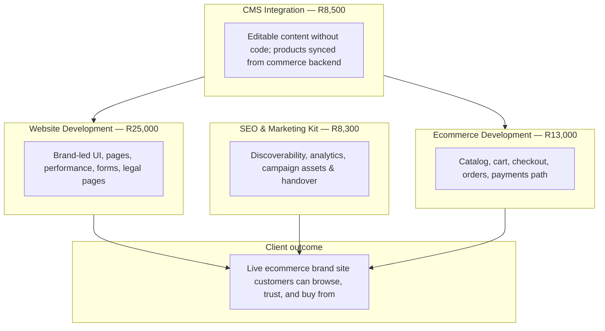
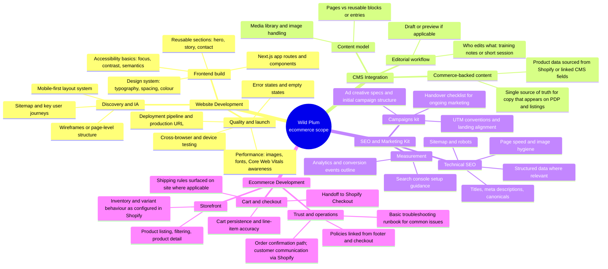
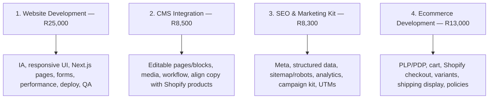
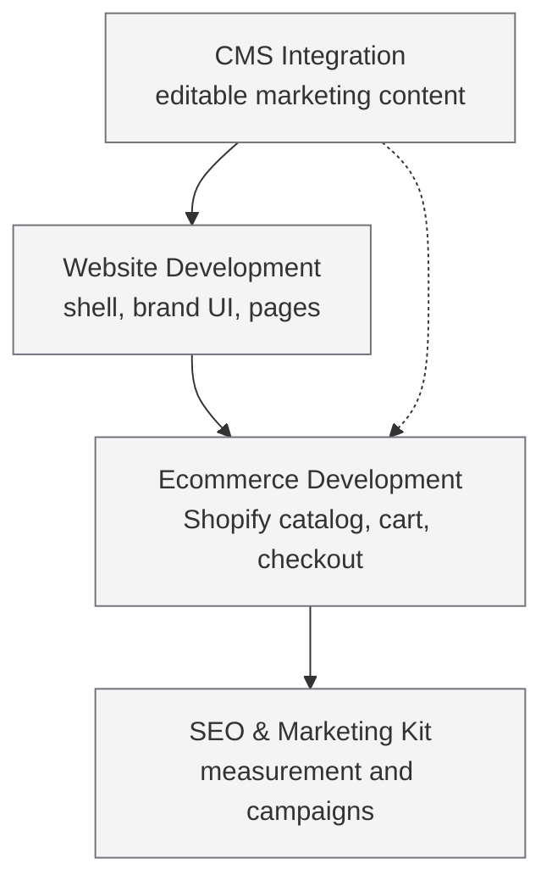

# Wild Plum Growers — Quote scope breakdown

**Quote:** CODE RIFFS · #10002 · dated 2026/03/18 · **Total: R54,800.00** (incl. four line items)

This document expands each quoted line into **what will be delivered** and **what the work entails**, so the scope is clear beyond the high-level titles on the quote.

---

## 1. Overview — how the four items fit together

---

## 2. Detailed breakdown (mind map)

---

## 3. Line-by-line: quote title → concrete work

| # | Quoted item | Amount | What you get (deliverables) | What the work entails |
|---|-------------|--------|----------------------------|------------------------|
| 1 | **Website Development** | R25,000.00 | Public site: home, story, contact, shop entry, shared header/footer, responsive layout, deployment to production, basic QA. | UX structure aligned to Wild Plum; Next.js/React implementation; brand styling; forms and validation; performance-conscious assets; staging-to-production workflow. |
| 2 | **CMS Integration** | R8,500.00 | Content editable in the CMS for agreed page types; images and copy manageable without deployments for routine updates; products remain driven by Shopify where applicable. | Content schema or sections; connection between CMS and the front end; editorial guidelines; optional preview depending on stack; coordination so product copy and CMS copy do not conflict. |
| 3 | **SEO & Marketing Kit (incl. ad campaigns)** | R8,300.00 | On-page SEO baseline, analytics hookup plan, Search Console orientation, initial paid-social/search campaign structure and creative specs, UTM and tracking hygiene. | Keyword and page mapping; meta and structured data; sitemap/robots; collaboration on ad audiences and creatives; not an open-ended unlimited ad spend—**media spend is separate** from this fee unless otherwise agreed. |
| 4 | **Ecommerce Development** | R13,000.00 | Shop experience: browse, product pages, cart, secure checkout via Shopify, order flow; integration with Shopify Storefront/cart APIs as designed for this project. | Product data model in Shopify; variant and pricing rules; checkout and payment compliance via Shopify; cart edge cases; shipping display rules agreed with you; post-launch bugfix window as per contract. |

---

## 4. Dependency view (what depends on what)

**Reading the diagram:** Ecommerce sits on top of the site shell (**Website Development**). **CMS** feeds marketing pages and may align copy with product storytelling. **SEO & Marketing** is most effective once URLs, products, and analytics exist (**Ecommerce** + **Website**).

---

## 5. Out of scope (typical clarifications)

These are **not** implied by the four titles unless explicitly added to a statement of work:

- Open-ended **ad media budget** (separate from setup and kit).
- Custom **ERP, accounting, or warehouse** integrations beyond Shopify’s standard features.
- **Photography or video** production (unless contracted separately).
- **Ongoing retainers** for SEO or ads after the agreed kit and handover.

---

*This breakdown describes the **substance** behind quote #10002. Exact timelines, revision rounds, and warranty periods should match your signed agreement with CODE RIFFS.*
